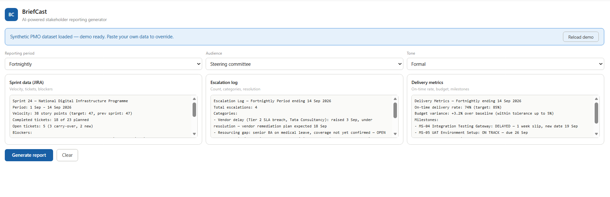
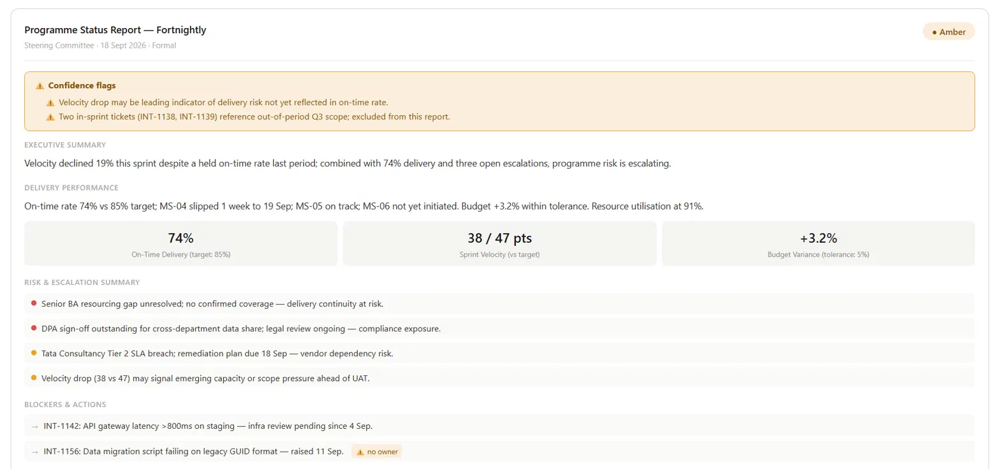

# BriefCast

**AI-powered stakeholder reporting generator for PMO portfolios.**

Paste raw data from three sources — a JIRA sprint export, an escalation log, and delivery metrics — set your audience and tone, and get a structured, governance-ready status report with RAG status, interpretive pattern recognition, and confidence flags.

---

## What it does

- Generates five-section leadership reports: Executive Summary, Delivery Performance, Risk & Escalation Summary, Blockers & Actions, Next Period Focus
- Interprets patterns the data implies — not just what it states (e.g. velocity drop as a leading indicator even when on-time rate holds)
- Flags ambiguous interpretations with ⚠️ rather than presenting guesses as conclusions
- Adapts tone and abstraction level to the selected audience: C-suite, Steering Committee, or Client

---

## Guardrails

| Guardrail | What it does |
|---|---|
| Data completeness check | Validates all three sources before generating — warns if any are empty or sparse |
| Scope creep detector | Flags input referencing work outside the declared reporting period |
| RAG Red confirmation | Intercepts before finalising if Red status is assigned on ambiguous data — requires human confirmation |
| Tone consistency check | Flags C-suite audience + technical input data mismatch before the report is shown |
| Audit trail | Attaches a timestamp and input data hash to every report for governance traceability |

---

## Tech stack

- React (JSX)
- Claude API — `claude-sonnet-4-6` for report generation and interpretive layer
- Synthetic PMO dataset hardcoded as JSON (demo works without any input)

---

## Getting started

### Prerequisites

- Node.js 18+
- An Anthropic API key

### Run locally

```bash
git clone https://github.com/rishendra125/briefcast_project
cd briefcast_project
npm install
```

Add your API key to a `.env` file:

```
VITE_ANTHROPIC_API_KEY=your_key_here
```

```bash
npm run dev
```

> **Note:** The Claude API call is proxied through the artifact runtime in the hosted demo. For local development, you will need to route the call through a backend or set up a proxy to keep your API key server-side.

---

## File structure

```
briefcast_project/
├── BriefCast.jsx             # Main React component
├── briefcast-casestudy.html  # Case study page
├── screenshots/              # Drop screenshots here for the case study
│   ├── briefcast-guardrails.png     # Input UI with synthetic PMO dataset loaded
│   └── briefcast-report.png        # Generated report: RAG status, confidence flags, risk summary
├── README.md
└── LICENSE
```

---

## Screenshots


*Input UI — synthetic PMO dataset pre-loaded, ready to generate*


*Generated report — RAG status, confidence flags, risk summary, and audit trail*

---

## Demo dataset

The app pre-loads a synthetic dataset modelled on a government digital infrastructure programme — Sprint 24, fortnightly period ending 14 Sep 2026. It includes a velocity drop, an unowned blocker, three open escalations, one milestone slip, and two out-of-period tickets to trigger the scope creep detector. The demo works immediately without any input from the user.

---

## License

MIT
